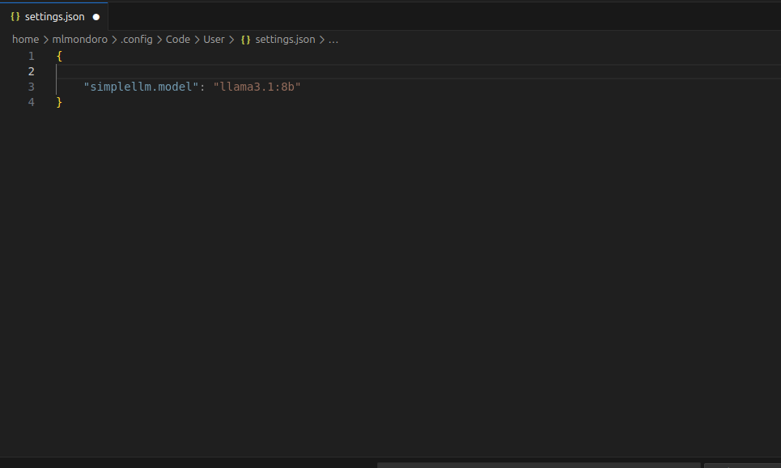

## SimpleLLM

Simple extension for interacting with LLMs deployed through HuggingFace Spaces

Once installed, edit your `settings.json` to add the config value for the [HuggingFace Space](https://huggingface.co/spaces) you wish to use. 

Once set up you can use the command palette to run any of the following commands:

1. Ask - ask the LLM a question - any selected text will be passed as context so you can ask about specific code you are working with
2. Generate - ask the LLM to generate some code - generated response will be inserted into the active editor
3. Create - create a new file with code generated by the LLM

**NOTE** you can obviously configure this to interface with ANY model on HuggingFace, this is only designed to work with text for coding assistance etc. Usage with other types of models (images, audio etc) will not work

